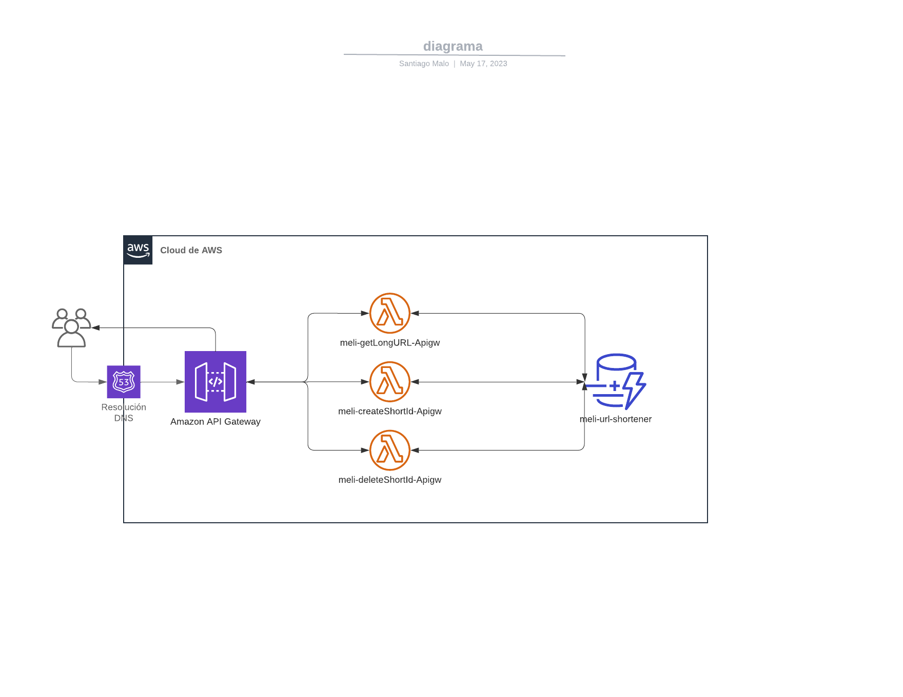

# Acortador de URL

Se desarrolla una solución en AWS que realiza las siguientes tareas:

- Dada una URL larga, el servicio debe devolver una URL corta.
- Dada una URL corta, el servicio debe devolver la URL larga original.
- Se pueden obtener estadísticas de las URLs que utilizan este servicio.
- Pueden manejarse solicitudes a gran escala.
- El 90% de todas las solicitudes pueden responderse en menos de 10 ms.
- Pueden borrarse las URLs cortas necesarias.
- Y lógicamente, cuando el usuario ingresa una URL corta válida en su navegador, debe ser redirigido a la URL larga correspondiente.

## Solución

La solución se desarrolla utilizando los siguientes servicios de AWS:

- **AWS Lambda**:
    - Dada una URL larga, devuelve una URL corta.
    - Dada una URL corta, devuelve la URL larga original.
    - Realiza la redirección a la URL larga cuando se llama a la URL corta.
    - Permite borrar las URLs cortas necesarias.

- **AWS DynamoDB**: 
    - Se utiliza para almacenar las URL largas y cortas.

- **AWS API Gateway**: 
    - Se utiliza para hacer los llamados a las funciones Lambda.

- **Route53**: 
    - Se utiliza para crear un dominio personalizado.

## Diagrama de Arquitectura

A continuación se muestra un diagrama de la arquitectura de la solución:

